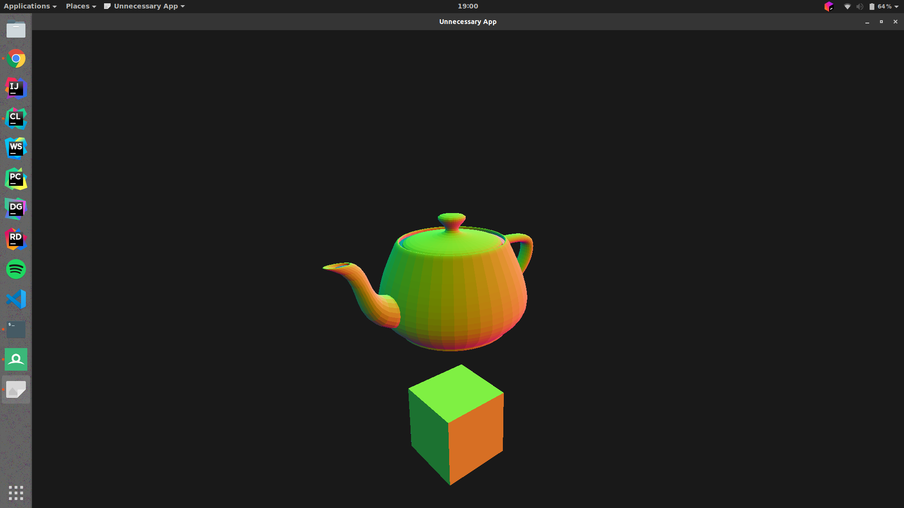

# The Unnecessary Engine
## A game engine that totally doesn't need to exist, but does.

An OpenGL based rendering engine.  
There is no reason for this to exist except for study purposes.

## Dependencies
* [GLEW](https://github.com/nigels-com/glew)
* [GLFW](https://github.com/glfw/glfw)
* [GLM](https://github.com/g-truc/glm)
* [LodePNG](https://github.com/lvandeve/lodepng)
* [TinyObjLoader](https://github.com/syoyo/tinyobjloader)